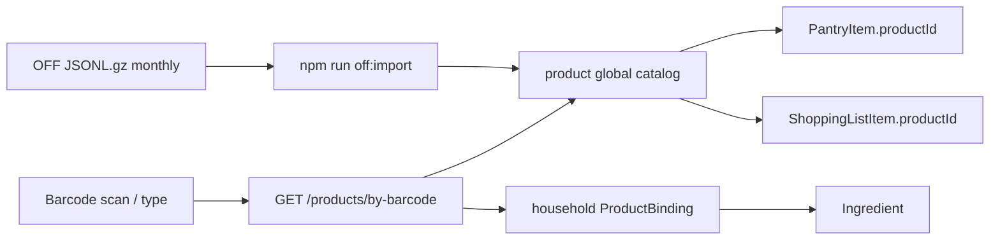

# Open Food Facts product layer

## Goals

- **Global `Product` catalog** from Open Food Facts: barcode, brand, pack size, nutriments — **no `householdId`**. OFF data is shared, read-only after import.
- **Household ingredient binding only**: each household maps a product → `Ingredient` for pantry math; that mapping is the only tenant-scoped product concern.
- **Offline mirror**: JSONL dump streamed into Postgres on a **monthly** refresh cadence; runtime lookups never hit the live OFF API.
- **Barcode scan** on pantry add (camera + manual entry).
- **Nutrition ready**: store per-100g nutriments on `Product`; no recipe nutrition UI in this slice.

## Architecture

Two tables, clear tenancy split:

| Table | Scope | Role |
|---|---|---|
| `Product` | **Global only** (no `householdId`) | OFF mirror / product catalog; barcode PK; nutriments; never written by household APIs |
| `ProductBinding` | Household | Maps `productId` → `ingredientId` for this household so pantry math knows the substance |

Households do **not** copy or fork OFF rows. Linking a barcode to flour writes a `ProductBinding`, not a private product duplicate.

Live API is deliberately unused (OFF blocks scraping; dumps are the supported bulk path). Attribution (ODBL / DbCL) goes in [README.md](README.md).

## Schema ([packages/backend/prisma/schema.prisma](packages/backend/prisma/schema.prisma))

**`Product`** (`@@map("product")`) — global, import-owned:

- `barcode` `String` `@id` (normalized digits-only GTIN/EAN)
- `name`, `brands`, `quantityRaw`
- `packQuantity` `Decimal?`, `packUnitId` `Int?` (parsed when possible; else null + keep `quantityRaw`)
- `categoriesTags` `String[]`
- `countriesTags` `String[]`
- `imageSmallUrl` `String?`
- `nutriments` `Json` — raw OFF nutriments for future features
- `nutriscoreGrade` `String?`
- `importedOn` `DateTime`
- No `householdId`. Mutations only via the import CLI.

**`ProductBinding`** (`@@map("product_binding")`) — household:

- `householdId`, `productId` (barcode FK), `ingredientId`
- `@@unique([householdId, productId])`
- Writes always scoped to the household (same tenancy rule as recipes)

**Wire into existing rows** (keep free-text `brand` for history / no-product lots):

- `PantryItem.productId` optional FK → global `Product`
- `ShoppingListItem.productId` optional FK → global `Product`
- `PriceObservation.productId` optional FK → global `Product`
- On create/receive: if `productId` set, copy `product.brands` (or first brand) into `brand` so existing display and generation keep working

Optional later (out of this slice): household-only custom products with no barcode — not required for OFF integration.

Prisma migration + [ERD.md](ERD.md) update.

## Offline import (monthly)

OFF publishes a current JSONL export (regenerated on their side often). **Our ops cadence is monthly**, not nightly:

- Documented schedule: refresh once per month (manual or cron); do not wire into nightly jobs or `dev:up`
- `npm run off:download` — fetch `https://static.openfoodfacts.org/data/openfoodfacts-products.jsonl.gz` into e.g. `data/off/`, stamp `downloadedOn`, verify checksum if available
- `npm run off:import -- --file ... [--countries en:united-states,...] [--replace]` — stream gunzip + JSONL; upsert into `product`

Defaults locked in:

- **Not** part of `dev:up` / docker entrypoint
- Default country filter for first-run docs: `en:united-states` (override with `--all` for full world)
- Idempotent upsert by barcode; `--replace` truncates then reloads
- Skip rows without a usable `code`
- Store only the fields above — not the full OFF document
- Small fixture JSONL under `packages/backend/prisma/seed/off-fixtures/` for tests/smoke

Implementation: Node stream pipeline in `packages/backend/src/off/import-off.cli.ts` (or `scripts/off-import.js`), batched upserts. README: disk/RAM expectations + “refresh monthly”.

## Backend API

New Nest module `packages/backend/src/products/`:

| Endpoint | Behavior |
|---|---|
| `GET /products/by-barcode/:code` | Normalize barcode → global `Product` + this household’s `ProductBinding` if any → `{ product?, binding?, suggestedIngredients[] }` or 404-style empty |
| `GET /products?q=` | Search **global** products by name/brand/barcode (limit hard-capped) |
| `PUT /products/:barcode/binding` | Upsert household binding `{ ingredientId }` — the only write path for “using” a product |
| `DELETE /products/:barcode/binding` | Remove household binding |
| `GET /products/bindings` | List this household’s bindings (for admin UI) |

Tenancy: `Product` is global read; binding writes are household-scoped. **No endpoint creates/edits/deletes `Product` rows** — import CLI only.

Pantry / shopping changes:

- [pantry.dto.ts](packages/backend/src/pantry/dto/pantry.dto.ts) / service: accept optional `productId` (barcode); validate product exists; if binding present, prefer its `ingredientId` when client omits one; denormalize brand from global product
- [shopping.service.ts](packages/backend/src/shopping/shopping.service.ts) `receive` / generation: pass through `productId`; prefill from last `PriceObservation.productId` when present
- Ingredient suggestions on unbound OFF hits: `IngredientsService.search` on product name / category — never auto-bind without user confirmation

## Frontend

Angular skill applies ([`.claude/skills/angular-developer/SKILL.md`](.claude/skills/angular-developer/SKILL.md)); Signal Forms only.

1. **Barcode field component** (`shared/barcode-scan.component.ts`):
   - Manual digit entry always
   - Camera: `BarcodeDetector` where supported; `@zxing/browser` fallback
   - Emits normalized barcode; plain signal + input (not a Signal Form)

2. **Pantry add lot** ([pantry-item-form.component.ts](packages/frontend/src/app/pantry/pantry-item-form.component.ts)):
   - Scan/type → `by-barcode`
   - If product + binding: fill ingredient + brand + pack hint, set `productId`
   - If product, no binding: show product card + ingredient picker → `PUT .../binding`, then attach `productId`
   - If none: today’s manual flow

3. **Bindings admin** (pantry or settings): list household bindings; change ingredient link; unbind

4. **Shopping list**: show product name/brand when `productId` set; receive preserves `productId`

5. Models + [api.service.ts](packages/frontend/src/app/core/api.service.ts)

Nutrition UI: optional Nutri-Score letter on the product card only — no recipe macros.

## Tests and verification

- Unit: barcode normalize; import parser on fixtures; `by-barcode` returns global product + optional binding; binding upsert is household-scoped; pantry create with `productId` denormalizes brand
- Assert no householdId on `Product` and no household Product-copy path
- No network in CI — fixtures only
- Manual: monthly-style `off:import` with fixtures/filtered dump → scan → bind → add lot → list → receive → confirm `productId` on lot and observation

## Docs

- [README.md](README.md): ODBL attribution, monthly download/import, disk note, no live API, global catalog vs household bindings
- [ERD.md](ERD.md): Product / ProductBinding / FKs
- [CHANGELOG.md](CHANGELOG.md) when shipping

## Explicit non-goals (this slice)

- Recipe or meal nutrition totals
- Live OFF API / contribution back to OFF
- Household-scoped copies of OFF products
- Nightly automated dump ingest (monthly only)
- Replacing Ingredient densities from OFF (pack nutrition ≠ cooking density)
- Shipping the multi-GB dump inside the Docker image
- Camera barcode required on every platform (manual entry is first-class)
