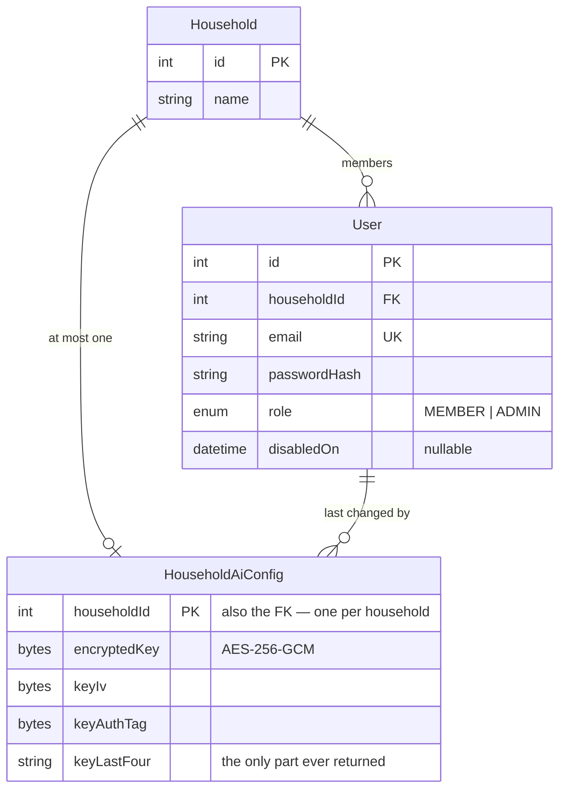
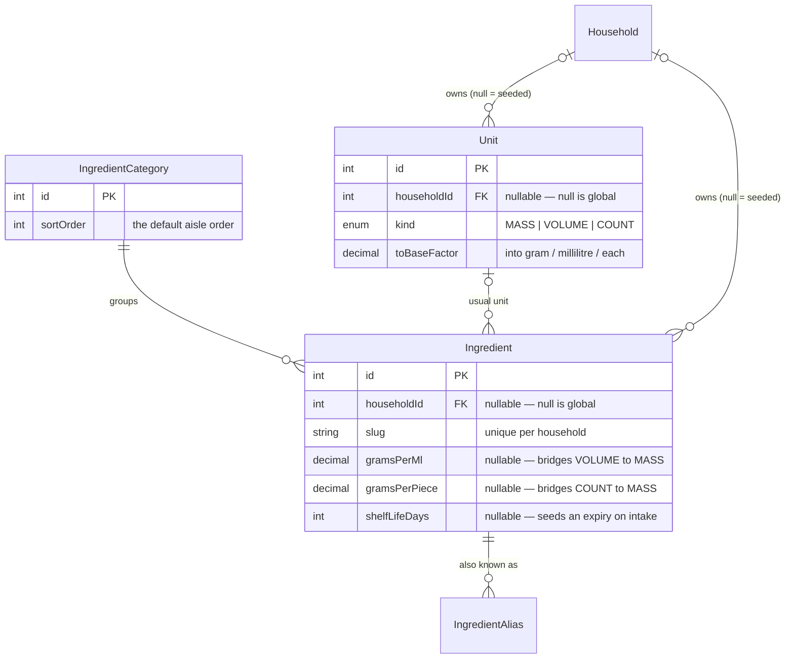
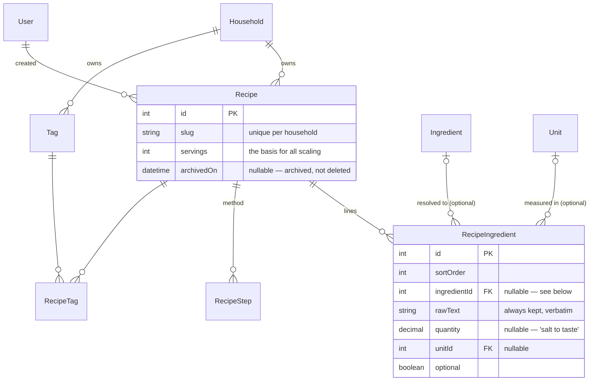
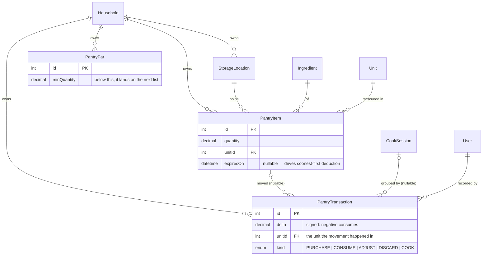
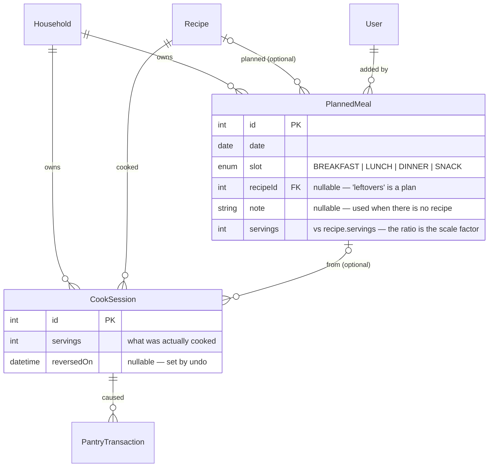
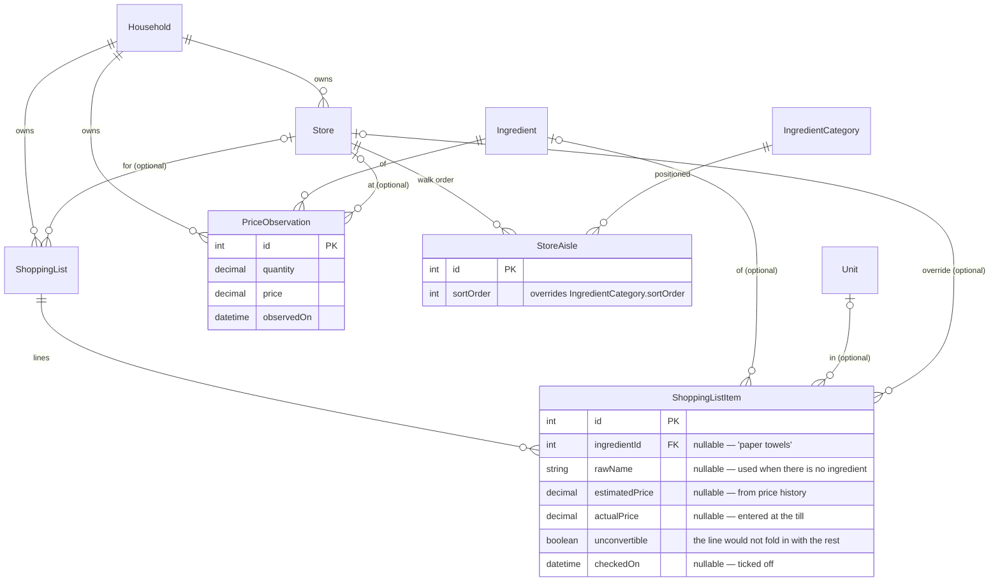

# The schema

[`packages/backend/prisma/schema.prisma`](packages/backend/prisma/schema.prisma) is
the source of truth. This is the map: what the tables are, how they hang
together, and — the part a diagram cannot show — which nullable columns are
nullable *on purpose*.

**Maintained by hand.** It is documentation, not a build artifact, so a schema
change means editing this too. That is deliberate: the interesting content here
is the reasoning, and a generator cannot produce it.

## Three kinds of table

The whole schema divides into three, and the division is enforced in code by the
Prisma client extension in
[`tenancy.ts`](packages/backend/src/prisma/tenancy.ts). Adding a table means
deciding which group it belongs to and saying so there.

| Kind | Tables | `householdId` | What the extension does |
|---|---|---|---|
| **Household-scoped** | `User`, `HouseholdAiConfig`, `Recipe`, `Tag`, `StorageLocation`, `PantryItem`, `PantryPar`, `PantryTransaction`, `PlannedMeal`, `CookSession`, `Store`, `ShoppingList`, `PriceObservation` | required | Every read and write is filtered to the caller's household; a `householdId` supplied by the caller is overwritten, not trusted |
| **Shared catalog** | `Unit`, `Ingredient` | **nullable** | Reads see global rows (`NULL`) *plus* the household's own; writes only ever touch the household's own |
| **Parent-scoped** | `Household`, `IngredientCategory`, `IngredientAlias`, `RecipeIngredient`, `RecipeStep`, `RecipeTag`, `StoreAisle`, `ShoppingListItem` | none | Nothing to filter on. Services must reach these through a scoped parent rather than by id |

That nullable `householdId` on the catalog is the load-bearing trick. It is what
lets one seeded ingredient list serve every household while still letting a
household correct a density for itself — and it is why editing a shared
ingredient forks a private copy (`POST /ingredients/:id/customize`) instead of
patching in place.

A query that reaches a scoped model with no household context **throws** rather
than running unfiltered. Crossing households needs an explicit `runUnscoped()`,
which exists in one place: authenticating someone before we know their
household.

## Conventions

- **Every quantity and price is `Decimal`, never `Float`.** Floating point on
  0.33 cups or $3.99 compounds badly across scaling and aggregation. They cross
  the wire as strings for the same reason.
- Table names are `snake_case` via `@@map`; columns are camelCase.
- Timestamps read as `createdOn` / `archivedOn` / `reversedOn`, not `*_at`.
- Soft deletion where history matters (`Recipe.archivedOn`, `User.deletedOn`),
  hard deletion where it does not.

## Households and users

`HouseholdAiConfig` uses `householdId` as its own primary key, which is what
makes "one key per household" a database fact rather than a convention. The key
is write-only at the API boundary: no endpoint returns `encryptedKey`, only
`keyLastFour`, so the UI can render `••••abcd`.

## Units and the ingredient catalog

These two columns are the engine's fuel. Conversion *within* a `UnitKind` is
arithmetic on `toBaseFactor`; conversion *across* kinds needs `gramsPerMl`
(volume ↔ mass) or `gramsPerPiece` (count ↔ mass). Where the ingredient has
neither, the conversion returns a typed failure and the app says so rather than
guessing — which is why both columns are nullable and why `NULL` must never be
read as zero or as 1.0.

`IngredientAlias` is what lets "scallions" find green onion. It is one of the
four routes the parser tries, in descending order of trust: exact slug, alias,
singularised slug, then `pg_trgm` similarity.

## Recipes

**`ingredientId` is nullable and `rawText` is never derived away.** Three real
cases need it: a parse that did not resolve, a line with no measurable amount,
and a one-off the cook does not want in the catalog. Unresolved lines display
normally and sit out of every pantry calculation — they are never guessed into
one.

`rawText` is the record of what was actually written, which is why the recipe
editor leaves it alone unless the line was renamed, and why the recipe screen
strips the amount back off it rather than printing the quantity twice.

A line with **no unit** is skipped by both shopping-list generation and cook
deduction, by the same rule in both: there is nothing to convert. "3 eggs"
parses that way, so the review screen is where a unit gets chosen.

## Pantry

**One row per physical lot, not per ingredient.** Two half-used bags of rice
with different expiry dates are genuinely two lots, and taking stock out spans
them soonest-expiry-first. No lot is ever driven negative; the remainder is
reported as a shortfall.

**The ledger is append-only.** Every change to stock writes a
`PantryTransaction` in the same database transaction as the change itself,
because cooking deducts a dozen ingredients at once and one mis-scaled cook
would otherwise corrupt the pantry with no way back.

`PantryTransaction.unitId` is why changing a lot's unit writes *two* entries —
the whole old amount out in the old unit, the whole new amount in in the new one
— rather than one delta. A single delta would mean subtracting grams from cups.
Each unit's column adds up on its own.

`pantryItemId` is nullable so the ledger can outlive the lot it describes: a
discarded lot's history is still true.

## The planner and cooking

`PlannedMeal.recipeId` is nullable because a calendar has to hold real life:
"leftovers", "dinner out". Those show on the grid and are skipped by cooking and
by shopping-list generation.

`CookSession` exists to group a deduction so it can be reversed as a unit.
**Undo writes the opposite ledger entries rather than deleting the originals** —
"cooked, then un-cooked" is a truer history than "never happened" — and stamps
`reversedOn` so a second undo cannot restore the same quantities twice. Undo
restores from the recorded delta, not a snapshot, so it stays correct when a lot
was topped up in between.

`CookSession.plannedMealId` is nullable in both directions of use: you can cook
something that was never on the calendar, and removing a planned meal detaches
its sessions rather than erasing the pantry history they caused.

## Stores and shopping

`StoreAisle` overrides `IngredientCategory.sortOrder` per store, so a generated
list reads in the order you actually walk that shop. The two numberings share
one scale, so the aisle editor places *every* category rather than some — a
partial order would interleave with the default instead of overriding it.

`ShoppingListItem.unconvertible` is narrower than it sounds: it marks a line
whose *demand* would not fold together with the rest for want of a density or
piece weight. A pantry balance that could not be subtracted is a different
thing, signalled by reporting nothing on hand rather than zero.

`receive` is the loop closing: ticked items become `PantryItem` rows *and*
`PriceObservation` rows in one transaction, which is what makes the next list's
`estimatedPrice` better without anyone keeping a second set of books.

## What disappears with its parent

Three behaviours, and only the first is stated explicitly in the schema. The
other two are Prisma's defaults — `SET NULL` for an optional relation, restrict
for a required one — so they are worth writing down precisely, because a default
still deletes your data.

**Cascade**, where the child is meaningless without its parent:

| Deleting | Takes with it |
|---|---|
| `Household` | `HouseholdAiConfig` |
| `Ingredient` | its `IngredientAlias` rows |
| `Recipe` | its `RecipeIngredient`, `RecipeStep`, `RecipeTag` rows |
| `Tag` | its `RecipeTag` rows |
| `Store` | its `StoreAisle` rows |
| `ShoppingList` | its `ShoppingListItem` rows |

**Set null**, where the child outlives the reference:

| Deleting | Nulls |
|---|---|
| `Household` | `Ingredient.householdId`, `Unit.householdId` — **see the warning below** |
| `Recipe` | `PlannedMeal.recipeId` |
| `PlannedMeal` | `CookSession.plannedMealId` |
| `CookSession` | `PantryTransaction.cookSessionId` |
| `PantryItem` | `PantryTransaction.pantryItemId` |
| `Ingredient` | `RecipeIngredient.ingredientId`, `ShoppingListItem.ingredientId` |
| `Unit` | `Ingredient.defaultUnitId`, `RecipeIngredient.unitId`, `ShoppingListItem.unitId` |
| `IngredientCategory` | `Ingredient.categoryId` |
| `Store` | `ShoppingList.storeId`, `ShoppingListItem.storeId`, `PriceObservation.storeId` |

Most of these are the ledger surviving what it describes, which is the point: a
discarded lot's history is still true, and a cook session detached from a
removed planned meal still moved real food.

**Restrict** — everything else, including every household-scoped table's
`householdId`, and `CookSession.recipeId`. So a recipe that has actually been
cooked cannot be deleted, which is why recipes archive (`archivedOn`) instead:
the pantry history it caused is still true. A `Store` still referenced by a list
or a price refuses deletion for the same reason, and says so.

> **Deleting a `Household` promotes its private catalog rows to global.**
> `Ingredient.householdId` and `Unit.householdId` are nullable so that `NULL`
> can mean "seeded, shared by everyone" — and `SET NULL` is Prisma's default for
> an optional relation. Put together, deleting a household hands its private
> ingredients to every other household instead of removing them. No endpoint
> deletes a household, so this is only reachable from a script or a console;
> both cleanup paths in this repo delete household-owned catalog rows explicitly
> first, and anything else that removes a household must do the same.

## Indexes worth knowing about

| Index | Why |
|---|---|
| `PantryItem(householdId, expiresOn)` | soonest-expiry-first deduction and the expiry warnings both read in this order |
| `PantryTransaction(householdId, ingredientId, createdOn)` | the ledger is always read as one ingredient's history |
| `PantryTransaction(cookSessionId)` | undo loads a whole session's movements at once |
| `Recipe(householdId, archivedOn)` | the collection hides archived rows by default |
| `PlannedMeal(householdId, date)` | every planner read is a date range |
| `IngredientAlias(slug)` | the parser's second matching route, hit once per pasted line |

Uniqueness carries meaning too: `Ingredient(householdId, slug)` and
`Unit(householdId, name)` are per-household rather than global, which is what
allows a household's private "flour" to coexist with the seeded one instead of
colliding with it.
